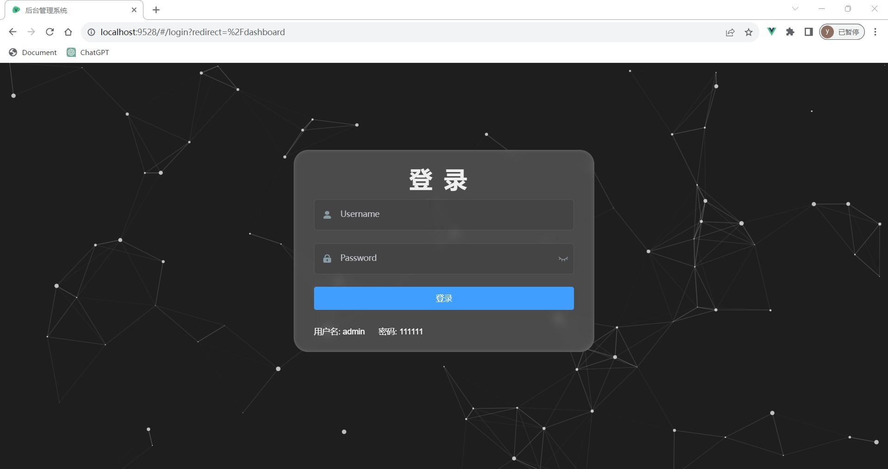
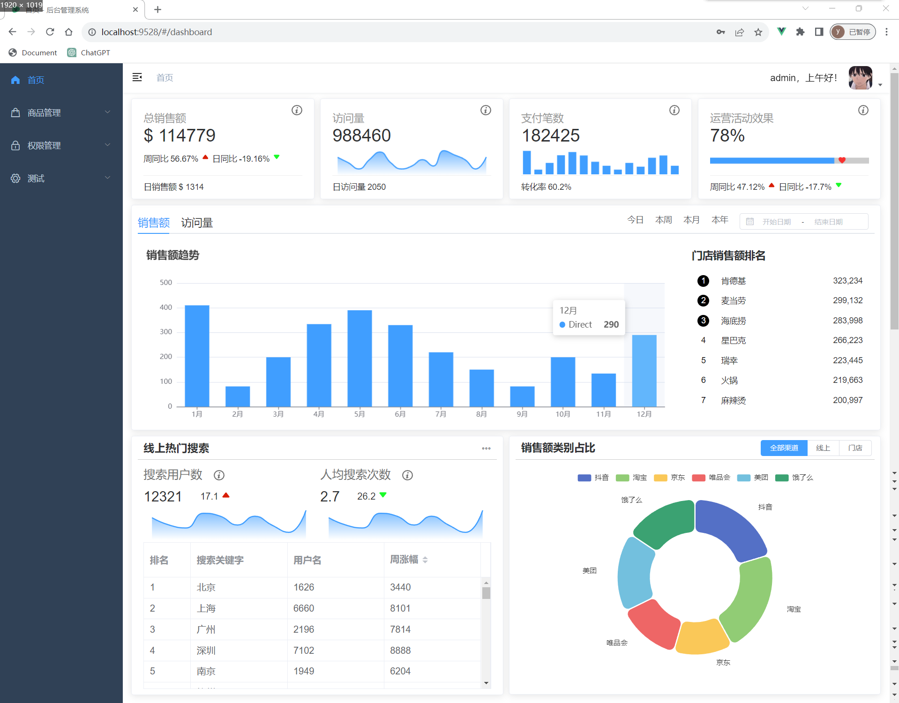
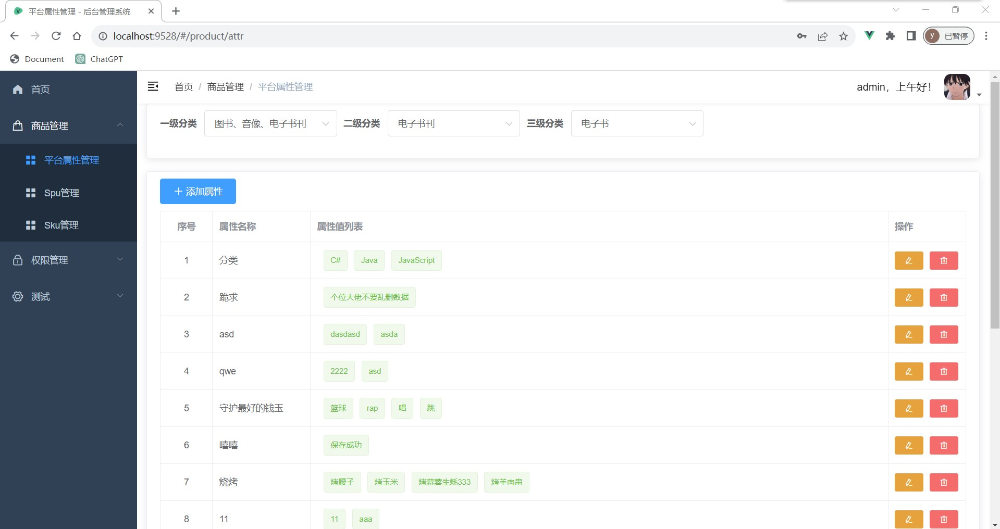
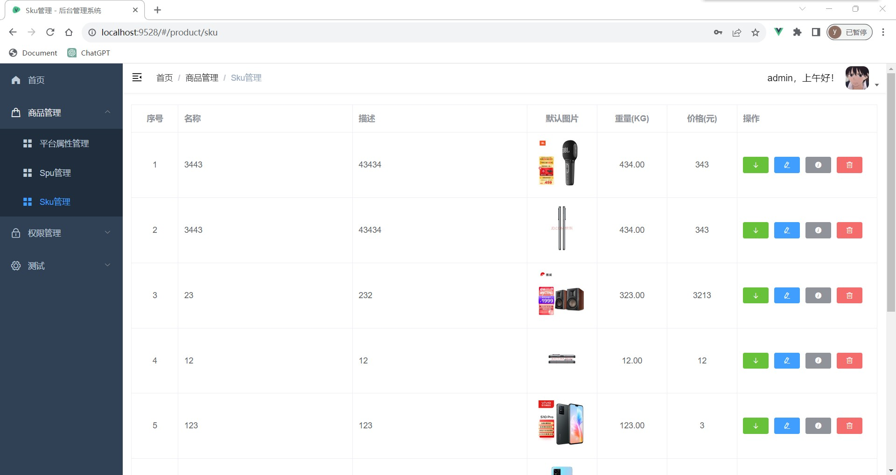
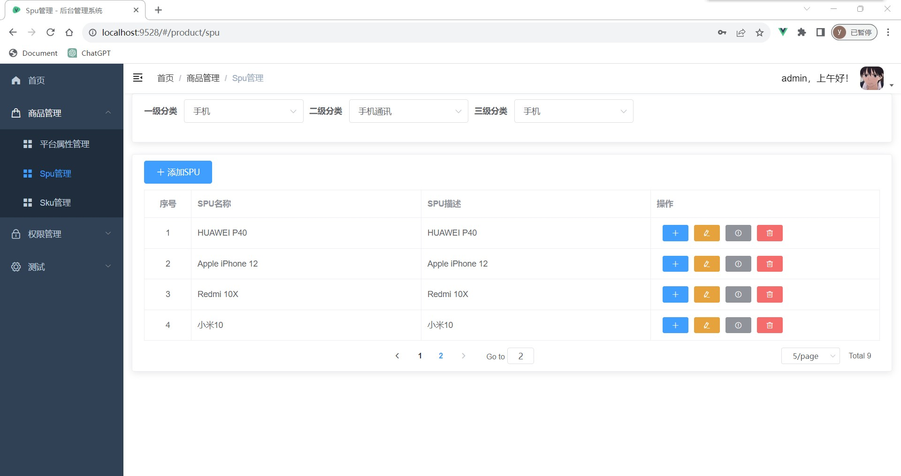
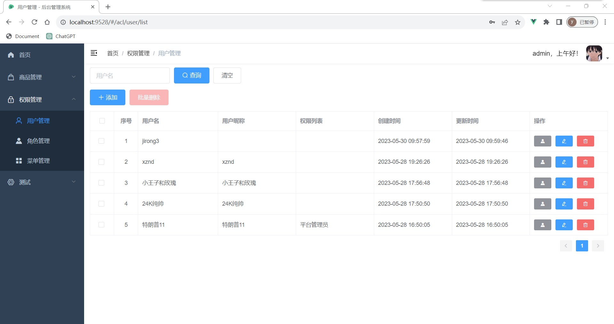
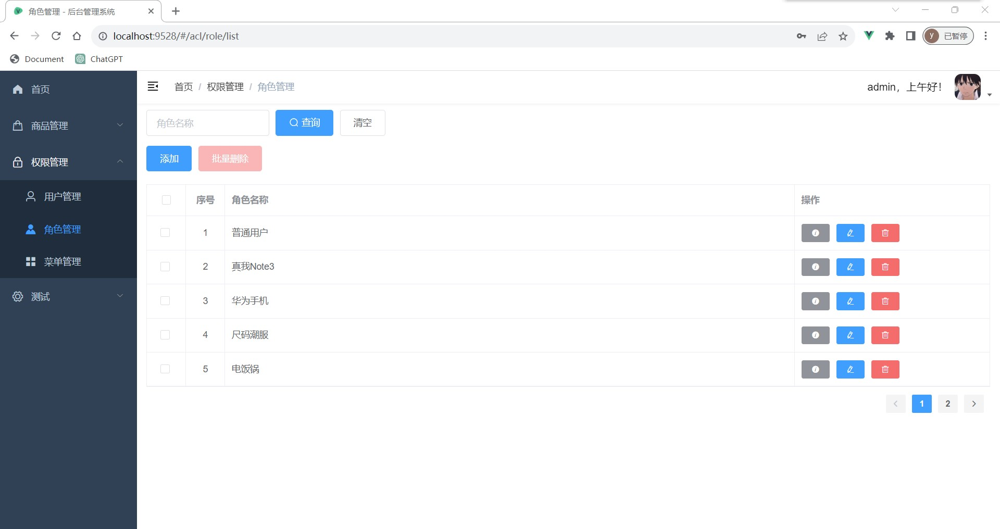
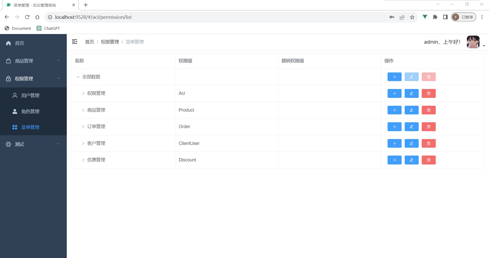

## 后台管理系统练习

### 首页登录



### 首页图表



### 商品管理





### 权限管理





### 项目依赖安装

```
npm install
```

### 项目运行
```
npm run dev
```

### 项目打包编译
```
//构建生产环境
npm run build:prod
//构成测试环境
npm run build:stage
```


