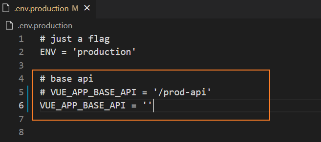
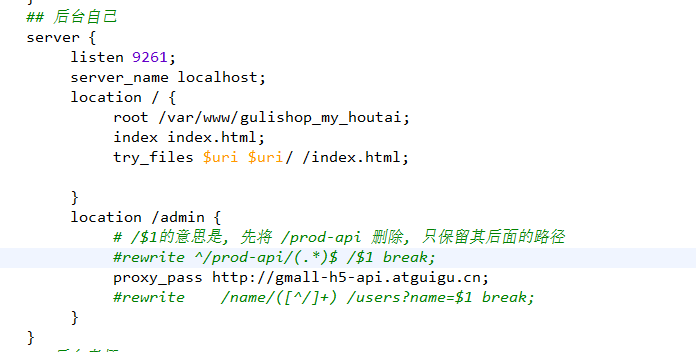

## 后台管理系统练习

### 首页登录


### 首页图表


### 商品管理


### 权限管理


### 项目依赖安装

```
npm install
```

### 项目运行
```
npm run dev
```

### 项目打包编译
```
//构建生产环境
npm run build:prod
//构成测试环境
npm run build:stage
```

#### 如果想在nginx上线,注意配置转发和删除.env.production的里面的内容(以生产环境打包为例)

* 需要删除Vue_APP_BASE_API里面的内容~



* nginx转发设置

  
